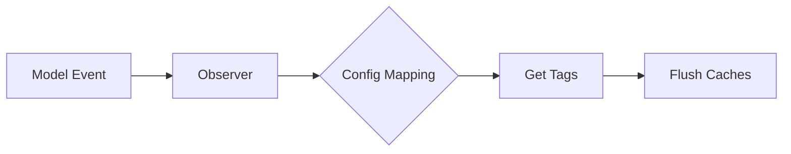

# Auto-Invalidation

::: tip Overview
Automatically invalidate caches when related models are modified, ensuring data consistency without manual cache management.
:::

## How It Works

The auto-invalidation system observes Eloquent model events and automatically flushes associated cache tags when models are created, updated, deleted, restored, or force deleted.



## Configuration

### Enable Auto-Invalidation

```php
// config/filterable.php
'cache' => [
    'auto_invalidate' => [
        'enabled' => true,
        'models' => [
            App\Models\Post::class => ['posts', 'content'],
            App\Models\User::class => ['users'],
            App\Models\Category::class => ['categories', 'posts'],
            App\Models\Comment::class => ['comments', 'posts'],
        ],
    ],
],
```

### Environment Variable

```env
FILTERABLE_AUTO_INVALIDATE=true
```

## Model-to-Tags Mapping

Define which cache tags should be flushed when each model changes:

```php
'models' => [
    // When Post model changes, flush 'posts' and 'content' tags
    App\Models\Post::class => ['posts', 'content'],

    // When User model changes, flush 'users' tag
    App\Models\User::class => ['users'],

    // When Category changes, flush both 'categories' and 'posts'
    // (because posts might be filtered by category)
    App\Models\Category::class => ['categories', 'posts'],
],
```

## Usage Example

### Step 1: Configure Tags

```php
// config/filterable.php
'auto_invalidate' => [
    'enabled' => true,
    'models' => [
        App\Models\Post::class => ['posts', 'blog'],
    ],
],
```

### Step 2: Use Tags in Filters

```php
// In your filter
$posts = Post::filter()
    ->cache(3600)
    ->cacheTags(['posts', 'blog']) // Match config tags
    ->get();
```

### Step 3: Automatic Invalidation

```php
// When a post is created, updated, or deleted...
$post = Post::create([...]);
// ✅ All caches with 'posts' and 'blog' tags are automatically flushed!

$post->update([...]);
// ✅ Caches flushed again!

$post->delete();
// ✅ Caches flushed!
```

## Observed Events

The system automatically handles these Eloquent events:

| Event          | Description                        |
| -------------- | ---------------------------------- |
| `created`      | Model is created                   |
| `updated`      | Model is updated                   |
| `deleted`      | Model is soft or hard deleted      |
| `restored`     | Model is restored from soft delete |
| `forceDeleted` | Model is permanently deleted       |

## Advanced Patterns

### Cascade Invalidation

When one model affects multiple cache types:

```php
'models' => [
    // Post changes affect multiple cache groups
    App\Models\Post::class => [
        'posts',
        'blog',
        'content',
        'homepage',
        'feeds',
    ],

    // Category changes affect posts and navigation
    App\Models\Category::class => [
        'categories',
        'posts',      // Posts filtered by category
        'navigation', // Site navigation with category counts
    ],
],
```

### Relationship-Based Invalidation

Flush caches when related models change:

```php
'models' => [
    // Comment changes should invalidate post caches
    App\Models\Comment::class => [
        'comments',
        'posts', // Because post.comments_count might change
    ],

    // Tag changes affect posts
    App\Models\Tag::class => [
        'tags',
        'posts', // Posts filtered by tags
    ],
],
```

### Multi-Tenant Invalidation

Handle tenant-specific cache invalidation:

```php
// Instead of global tags, use tenant-scoped caching
$posts = Post::filter()
    ->cache(3600)
    ->scopeByTenant($tenantId)
    ->cacheTags(['posts', "tenant:{$tenantId}"])
    ->get();

// Config maps to tenant-aware tags
'models' => [
    App\Models\Post::class => ['posts'], // Global invalidation
    // Tenant-specific handled by scoping
],
```

## Performance Considerations

### Tag Granularity

Balance between granular control and performance:

```php
// ❌ Too granular (many small tag flushes)
'models' => [
    App\Models\Post::class => [
        'posts',
        'posts:published',
        'posts:draft',
        'posts:archived',
        'posts:category:1',
        'posts:category:2',
        // ...
    ],
],

// ✅ Good balance (reasonable tag count)
'models' => [
    App\Models\Post::class => ['posts', 'content'],
    App\Models\Category::class => ['categories', 'posts'],
],
```

### Conditional Invalidation

Only invalidate when specific fields change:

```php
// In your model
class Post extends Model
{
    protected static function booted()
    {
        // Only invalidate cache if published status changed
        static::updated(function ($post) {
            if ($post->isDirty('status')) {
                \Kettasoft\Filterable\Caching\FilterableCacheManager::getInstance()
                    ->flushByTags(['posts:published']);
            }
        });
    }
}
```

## Cache Tracking

Monitor auto-invalidation events:

```php
// config/filterable.php
'cache' => [
    'tracking' => [
        'enabled' => true,
        'log_channel' => 'daily',
    ],
],
```

Log entries will show:

```
[2024-01-15 10:30:45] daily.INFO: Filterable cache invalidated
{
    "model": "App\\Models\\Post",
    "tags": ["posts", "content"],
    "timestamp": "2024-01-15T10:30:45+00:00"
}
```

## Manual Invalidation

Override automatic behavior when needed:

```php
// Flush specific tags manually
\Kettasoft\Filterable\Caching\FilterableCacheManager::getInstance()
    ->flushByTags(['posts']);

// Or use static method
Post::flushCacheByTagsStatic(['posts', 'content']);

// Flush all caches for a specific filter
$filter = new PostFilter();
$filter->flushCache(); // Uses auto-generated class tag
```

## Testing Auto-Invalidation

Test that caches are properly invalidated:

```php
use Tests\TestCase;
use App\Models\Post;
use Illuminate\Support\Facades\Cache;

class CacheInvalidationTest extends TestCase
{
    /** @test */
    public function it_invalidates_cache_when_post_is_updated()
    {
        $post = Post::factory()->create();

        // Cache some data
        $cached = Post::filter()
            ->cache(3600)
            ->cacheTags(['posts'])
            ->get();

        $this->assertCount(1, $cached);

        // Update the post (should trigger invalidation)
        $post->update(['title' => 'Updated']);

        // Cache should be cleared, fresh data retrieved
        $fresh = Post::filter()
            ->cache(3600)
            ->cacheTags(['posts'])
            ->get();

        $this->assertEquals('Updated', $fresh->first()->title);
    }
}
```

## Common Patterns

### Pattern 1: Blog System

```php
'auto_invalidate' => [
    'enabled' => true,
    'models' => [
        // Posts
        App\Models\Post::class => ['posts', 'blog', 'feed'],

        // Comments invalidate posts too
        App\Models\Comment::class => ['comments', 'posts'],

        // Categories affect post listings
        App\Models\Category::class => ['categories', 'posts'],

        // Tags affect post filtering
        App\Models\Tag::class => ['tags', 'posts'],

        // Authors affect post author pages
        App\Models\User::class => ['users', 'authors'],
    ],
],
```

### Pattern 2: E-commerce

```php
'auto_invalidate' => [
    'enabled' => true,
    'models' => [
        // Products
        App\Models\Product::class => ['products', 'catalog'],

        // Categories affect product listings
        App\Models\Category::class => ['categories', 'products'],

        // Inventory changes affect availability
        App\Models\Inventory::class => ['inventory', 'products'],

        // Prices affect product displays
        App\Models\Price::class => ['prices', 'products'],

        // Reviews affect product ratings
        App\Models\Review::class => ['reviews', 'products'],
    ],
],
```

### Pattern 3: Multi-Tenant SaaS

```php
'auto_invalidate' => [
    'enabled' => true,
    'models' => [
        // Tenant-level resources
        App\Models\Tenant::class => ['tenants'],

        // User changes within tenant
        App\Models\User::class => ['users'],

        // Tenant-specific data
        App\Models\Project::class => ['projects'],
        App\Models\Task::class => ['tasks', 'projects'],
    ],
],

// Use scoped caching per tenant
$projects = Project::filter()
    ->cache(3600)
    ->scopeByTenant(tenant()->id)
    ->cacheTags(['projects'])
    ->get();
```

## Troubleshooting

### Cache Not Invalidating

1. **Check if auto-invalidation is enabled:**

    ```php
    config('filterable.cache.auto_invalidate.enabled')
    ```

2. **Verify model is in config:**

    ```php
    // Make sure model class is correctly namespaced
    App\Models\Post::class => ['posts']
    ```

3. **Check cache driver supports tags:**

    ```bash
    # Tags require Redis or Memcached
    php artisan config:show cache.default
    ```

4. **Enable tracking to see logs:**
    ```php
    'tracking' => ['enabled' => true]
    ```

### Observer Not Firing

1. **Clear config cache:**

    ```bash
    php artisan config:clear
    ```

2. **Verify observer is registered:**

    ```bash
    php artisan route:list | grep CacheInvalidationObserver
    ```

3. **Check model events are firing:**
    ```php
    Post::observe(new class {
        public function updated($post) {
            logger('Post updated: ' . $post->id);
        }
    });
    ```

## Best Practices

1. **✅ Use hierarchical tags:**

    ```php
    ['posts', 'posts:published', 'content']
    ```

2. **✅ Keep model mappings simple:**

    - 2-4 tags per model is ideal
    - Avoid over-granular tags

3. **✅ Test invalidation:**

    - Write tests for critical cache flows
    - Monitor logs in production

4. **✅ Document tag usage:**

    - Maintain a tag registry
    - Document which features use which tags

5. **❌ Avoid:**
    - Too many tags (performance overhead)
    - Missing required tags (stale caches)
    - Circular dependencies (redundant flushes)

::: tip Next Steps

-   [Cache profiles →](./profiles.md)
-   [Monitoring and debugging →](./monitoring.md)
-   [API reference →](../api/caching.md)
    :::
